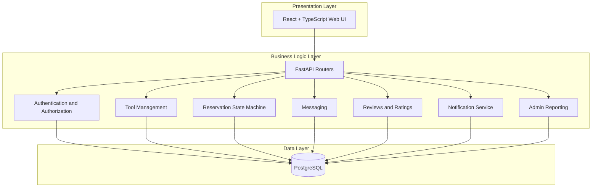
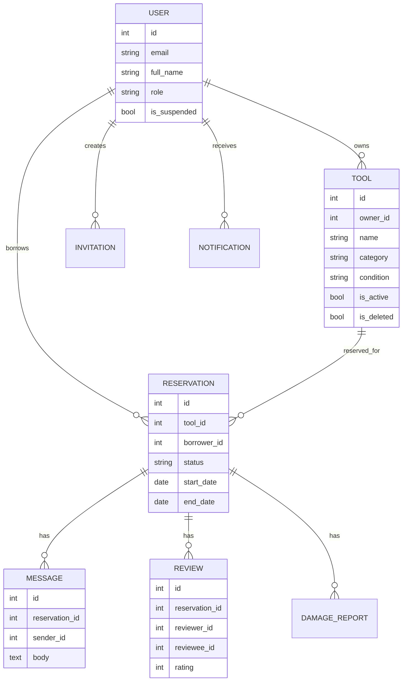
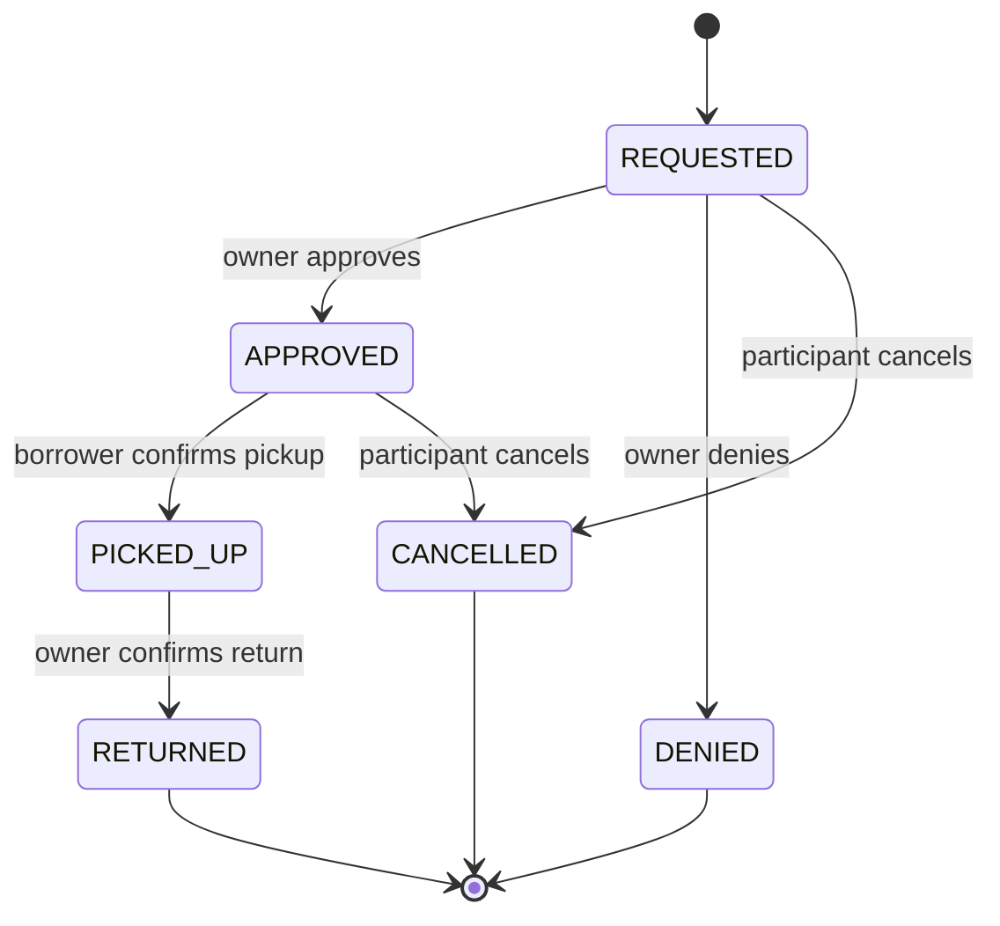

# Architecture Design

## Style

Layered 3-tier architecture.

## Backend component responsibilities

| Component | Responsibility |
| --- | --- |
| `routers/auth.py` | Register with invite, login, current user |
| `routers/tools.py` | Listing CRUD, hide/show/delete, search, availability |
| `routers/reservations.py` | Request, approve, deny, cancel, pickup, return |
| `services/reservations.py` | Reservation state machine and overlap rules |
| `routers/messages.py` | Private message thread per reservation |
| `routers/reviews.py` | Returned-only reviews and ratings |
| `routers/notifications.py` | User notification list and read state |
| `routers/admin.py` | User suspension, listing deactivation, reports |
| `models.py` | Database entities and relationships |
| `schemas.py` | API validation and response shapes |

## Domain model

## Reservation state machine

## Tradeoffs

- JWT authentication is simple and demo-friendly, but a production system would add refresh tokens and stronger session controls.
- Automatic table creation avoids migration complexity for the course, but migrations should be introduced before production.
- `photo_url` keeps the frontend simple and avoids object storage setup.
- Reminder notifications are represented in the data model but do not use a background scheduler.
